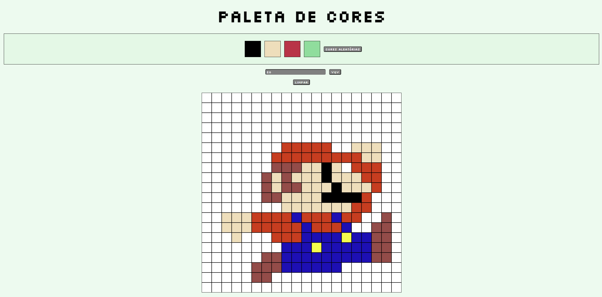

# Projeto Pixels Art (Terceiro projeto desenvolvido)

Neste projeto, mergulhamos de cabeça na aplicação dos princípios essenciais de manipulação do Document Object Model (DOM) por meio da tríade formidável: JavaScript, HTML e CSS. Além disso, adicionamos uma camada extra de criatividade, introduzindo um editor de arte com pixels.

Em termos mais simples, criamos uma plataforma onde os usuários têm à disposição uma paleta de cores e um quadro composto por pixels. Nesse ambiente, eles têm a liberdade de dar asas à sua criatividade e pintar o que desejarem no quadro. Isso requer não apenas uma compreensão profunda da tecnologia web, mas também habilidades de interação com o usuário e design de interface, proporcionando uma experiência única e envolvente. Este projeto representa um passo significativo em nossa jornada de desenvolvimento web e uma oportunidade de aplicar conceitos práticos e criativos em uma aplicação interativa.

## Habilidades desenvolvidas

Durante a execução deste projeto, foram amplamente aprimoradas as seguintes habilidades:

- Manipulação do DOM via JavaScript;
- Resolução de problemas;
- Estilização de página via CSS.

## O que foi desenvolvido pelo autor

Todo o conteúdo e elementos presentes na pasta "images", bem como os arquivos "index.html", "style.css" e "script.js" foram desenvolvidos exclusivamente por mim, representando minha contribuição integral a este projeto. É importante mencionar que os demais arquivos foram elaborados pela equipe da Trybe como parte do contexto mais amplo do projeto.

## Requisitos do projeto

1. Adicionar à página o título "Paleta de Cores";
2. Adicionar à página uma paleta contendo quatro cores distintas;
3. Adicionar a cor preta como a primeira cor da paleta de cores;
4. Adicionar um botão para gerar cores aleatórias para a paleta de cores;
5. Implementar uma função usando localStorage para que a paleta de cores gerada aleatoriamente seja mantida após recarregar a página;
6. Adicionar à página um quadro contendo 25 pixels;
7. Fazer com que cada pixel do quadro tenha largura e altura de 40 pixels e borda preta de 1 pixel de espessura;
8. Definir a cor preta como cor inicial da paleta de cores;
9. Criar uma função para selecionar uma cor na paleta de cores e preencha os pixels no quadro;
10. Criar uma função que permita preencher um pixel do quadro com a cor selecionada na paleta de cores;
11. Criar um botão que retorne a cor do quadro para a cor inicial;
12. Criar uma função para salvar e recuperar o seu desenho atual no localStorage;
13. Criar um input que permita à pessoa usuária preencher um novo tamanho para o quadro de pixels;
14. Criar uma função que limite o tamanho mínimo e máximo do quadro de pixels.

## Demonstração de como ficou o projeto depois de pronto

